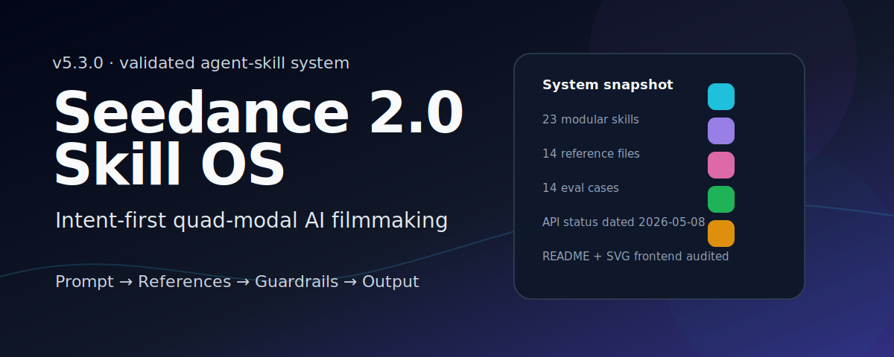
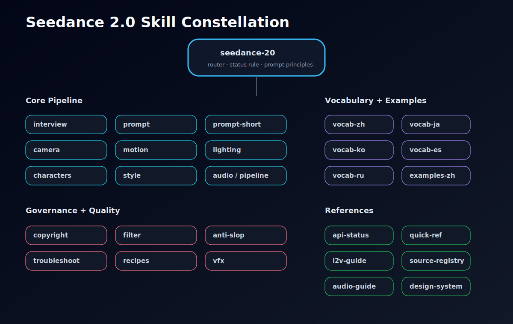

<picture>
  <source media="(prefers-color-scheme: dark)" srcset="assets/hero-dark.svg">
  <source media="(prefers-color-scheme: light)" srcset="assets/hero-light.svg">
  
</picture>

<p align="center">
  <a href="https://github.com/Emily2040/seedance-2.0/releases"></a>
  <a href="LICENSE"></a>
  <a href="skills"></a>
  <a href="#-multilingual-precision"></a>
  <a href="#-platform-matrix"></a>
  <a href="https://agentskills.io/"></a>
</p>

<p align="center">
  <code>Generate and direct cinematic AI videos with Seedance 2.0 (ByteDance / Dreamina / Jimeng).</code><br>
  <code>Text-to-Video · Image-to-Video · Video-to-Video · Reference-to-Video</code>
</p>

<p align="center">
  <b>Author:</b> <a href="https://github.com/Emily2040">Emily (@iamemily2050)</a> &nbsp;|&nbsp;
  <a href="https://x.com/iamemily2050">𝕏</a> &nbsp;|&nbsp;
  <a href="https://instagram.com/iamemily2050">IG</a><br>
  <b>Platform:</b> <a href="https://seed.bytedance.com/en/seedance2_0">ByteDance Seedance 2.0</a> · <a href="https://dreamina.capcut.com/tools/seedance-2-0">Dreamina</a> · <a href="https://jimeng.jianying.com/">Jimeng</a><br>
  <b>Updated:</b> 2026-04-27 · v5.1.0 validation and source-hygiene release
</p>

---

## `>` The v5.1 Philosophy: Intent Over Precision

This library teaches you to **direct** the AI, not micro-manage it. Tell the model WHAT you want and HOW it should FEEL. Use `@references` to show, not tell.

| Workflow | Best for | Start here |
|:---|:---|:---|
| **Full Interview** | Vague idea, need creative guidance | [seedance-interview](skills/seedance-interview/SKILL.md) |
| **Direct Prompt** | Clear vision, have reference media | [seedance-prompt](skills/seedance-prompt/SKILL.md) |

> **Note from the field (verified 2026-04-27):** Seedance V2 performs significantly better with short prompts (30-100 words) written in Chinese. The v5.1 prompt system enforces this by default.

---

## `>` Why Seedance 2.0?

<table>
<tr>
<td width="50%">

**For AI Filmmakers** — Stop writing flat prompts. Seedance 2.0 gives you a complete director's toolkit: camera language, motion control, lighting design, character fidelity, audio sync, and VFX integration — all structured as modular, composable skills that any AI agent can load on demand.

</td>
<td width="50%">

**For Agent Builders** — Each of the 23 sub-skills is independently loadable. Your agent reads the root `SKILL.md`, identifies the task, and loads only the specific modules it needs. Zero token waste. Maximum precision.

</td>
</tr>
</table>

> ⚠️ **Status (verified 2026-04-27):** Seedance 2.0 platform and API behavior changes quickly. For API availability, face/portrait authorization, upload limits, pricing, and regional access, check `references/api-status.md` and verify current primary sources. Real-person likeness workflows require authorization and are surface-specific. Run `seedance-copyright` before protected-IP, celebrity, brand, or real-person workflows.

<br>

## `>` Skill Constellation

> **Click any node** to navigate directly to that skill's documentation.

<p align="center">
  
</p>

<details>
<summary><b>📂 Full Skill Directory — Core Pipeline</b></summary>
<br>

| Skill | Emoji | What it does |
|:---|:---:|:---|
| [`seedance-interview`](skills/seedance-interview/SKILL.md) | 🎭 | Director's Journey with Quick Mode exit and genre detection |
| [`seedance-interview-short`](skills/seedance-interview-short/SKILL.md) | 🎙️ | Compressed interview outputting a 30-100 word brief with live counter |
| [`seedance-prompt`](skills/seedance-prompt/SKILL.md) | ✍️ | Director's Formula: genre router, 30-100 word target, I2V gate, anti-slop check |
| [`seedance-prompt-short`](skills/seedance-prompt-short/SKILL.md) | ⚡️ | 30-100 word budget system with Compression Engine |
| [`seedance-camera`](skills/seedance-camera/SKILL.md) | 🎥 | One-Move Rule, genre camera presets, camera transfer via @Video |
| [`seedance-motion`](skills/seedance-motion/SKILL.md) | 🏃 | Intent-first motion, @Video reference primary, physics consequences |
| [`seedance-lighting`](skills/seedance-lighting/SKILL.md) | 💡 | Lighting, atmosphere, light transitions, mood and time-of-day specs |
| [`seedance-characters`](skills/seedance-characters/SKILL.md) | 🎭 | Character identity locking, @Tag assignment, multi-character scene management |
| [`seedance-style`](skills/seedance-style/SKILL.md) | 🎨 | Visual style, render-engine tokens, period aesthetics, style-transfer reference |
| [`seedance-vfx`](skills/seedance-vfx/SKILL.md) | ✨ | VFX physics contracts, particle systems, destruction, energy effects |
| [`seedance-audio`](skills/seedance-audio/SKILL.md) | 🔊 | Native audio design, dialogue lip-sync, @Audio1 reference, desync fixes |
| [`seedance-pipeline`](skills/seedance-pipeline/SKILL.md) | 🔗 | ComfyUI nodes, API integration, Firebase Studio, post-processing chains |
| [`seedance-recipes`](skills/seedance-recipes/SKILL.md) | 📖 | 7-genre template library: product, lifestyle, drama, MV, landscape, commercial, anime |
| [`seedance-troubleshoot`](skills/seedance-troubleshoot/SKILL.md) | 🔧 | Diagnostic tree: 5-step root cause analysis for common failure modes |

</details>

<details>
<summary><b>⚖️ Content Quality & Governance</b></summary>
<br>

| Skill | Emoji | What it does |
|:---|:---:|:---|
| [`seedance-copyright`](skills/seedance-copyright/SKILL.md) | ⚖️ | IP rules, safe substitutions, authorization-dependent enforcement guidance |
| [`seedance-antislop`](skills/seedance-antislop/SKILL.md) | 🚫 | Detects and removes AI filler language and hollow superlatives from prompts |
| [`seedance-filter`](skills/seedance-filter/SKILL.md) | 🛡️ | Content filter intelligence: diagnose false-positive blocks, write prompts that pass |

</details>

<details>
<summary><b>🌍 Multilingual Vocabulary</b></summary>
<br>

| Skill | Flag | Languages | Terms |
|:---|:---:|:---|---:|
| [`seedance-vocab-zh`](skills/seedance-vocab-zh/SKILL.md) | 🇨🇳 | Chinese cinematic vocabulary | 400+ |
| [`seedance-vocab-ja`](skills/seedance-vocab-ja/SKILL.md) | 🇯🇵 | Japanese cinematic vocabulary | 280+ |
| [`seedance-vocab-ko`](skills/seedance-vocab-ko/SKILL.md) | 🇰🇷 | Korean cinematic vocabulary | 270+ |
| [`seedance-vocab-es`](skills/seedance-vocab-es/SKILL.md) | 🇪🇸 | Spanish cinematic vocabulary (Castilian + Latin American) | 270+ |
| [`seedance-vocab-ru`](skills/seedance-vocab-ru/SKILL.md) | 🇷🇺 | Russian cinematic vocabulary (Eisenstein/Tarkovsky tradition) | 270+ |

</details>

<details>
<summary><b>🇨🇳 Working Examples (Chinese Prompts)</b></summary>
<br>

| # | Genre | Difficulty | Description |
|:---:|:---|:---:|:---|
| 1 | 剧情短剧 Short Drama | Expert | 霸道总裁爽剧风格 — 15s multi-shot reversal scene |
| 2 | 剧情短剧 Short Drama | Beginner | 优雅晾衣场景 — simple elegant action loop |
| 3 | 剧情短剧 Short Drama | Intermediate | 维多利亚时代街景 — period drama environment |
| 4 | 广告 Advertising | Advanced | 互动绘画角色 — painting character comes alive |
| 5 | 广告 Advertising | Creative | 摩托车广告 — donkey motorcycle stunt ad |
| 6 | 广告 Advertising | Creative | 反转零食广告 — spy thriller snack reveal |
| 7 | 动漫武打 Animation | Expert | 哪吒 vs 敖丙 — 4-act ice/fire battle sequence |
| 8 | 动漫武打 Animation | Advanced | 多视频参考打斗 — multi-reference fight scene |
| 9 | 产品展示 Product | Intermediate | 高端香水 MG 动画 — luxury perfume ad |
| 10 | 产品展示 Product | Advanced | 多图融合产品展示 — multi-image bag showcase |
| 11 | 产品展示 Product | Advanced | 经典广告节奏复刻 — car ad licensed rhythm reference |
| 12 | 视觉特效 VFX | Advanced | 粒子特效片头 — gold particle title animation |
| 13 | 运镜叙事 Cinematography | Advanced | 一镜到底追踪镜头 — one-take tracking shot |
| 14 | 运镜叙事 Cinematography | Advanced | 动作+运镜双重复刻 — dance licensed performance reference |
| 15 | 运镜叙事 Cinematography | Advanced | 角色替换 — character replacement in video |
| 16 | 音乐卡点 Beat Sync | Advanced | 风光片音乐卡点 — landscape beat sync |

→ Full prompts: [`skills/seedance-examples-zh/SKILL.md`](skills/seedance-examples-zh/SKILL.md)

</details>

<br>

## `>` Quick Install

```bash
# Antigravity
antigravity skills install https://github.com/Emily2040/seedance-2.0

# Gemini CLI
gemini skills install https://github.com/Emily2040/seedance-2.0

# Claude Code
claude skills install https://github.com/Emily2040/seedance-2.0

# GitHub Copilot / Codex
codex skills install https://github.com/Emily2040/seedance-2.0

# Cursor
cursor skills install https://github.com/Emily2040/seedance-2.0

# Windsurf
windsurf skills install https://github.com/Emily2040/seedance-2.0

# OpenCode
opencode skills install https://github.com/Emily2040/seedance-2.0
```

<details>
<summary><b>📁 Manual Installation Paths</b></summary>
<br>

| Platform | Workspace path | Global path |
|:---|:---|:---|
| [**Antigravity**](https://antigravity.google/) | `.agent/skills/seedance-20/` | `~/.gemini/antigravity/skills/seedance-20/` |
| [**Gemini CLI**](https://geminicli.com/) | `.gemini/skills/seedance-20/` | `~/.gemini/skills/seedance-20/` |
| [**Firebase Studio**](https://firebase.studio/) | `.idx/skills/seedance-20/` | — |
| [**Claude Code**](https://code.claude.com/) | `.claude/skills/seedance-20/` | `~/.claude/skills/seedance-20/` |
| [**OpenClaw**](https://openclaw.ai/) | `.claude/skills/seedance-20/` | `~/.claude/skills/seedance-20/` |
| [**GitHub Copilot**](https://github.com/features/copilot) | `.github/skills/seedance-20/` | `~/.copilot/skills/seedance-20/` |
| [**Codex**](https://openai.com/codex/) | `.agents/skills/seedance-20/` | `~/.agents/skills/seedance-20/` |
| [**Cursor**](https://cursor.com/) | `.cursor/skills/seedance-20/` | `~/.cursor/skills/seedance-20/` |
| [**Windsurf**](https://windsurf.com/) | `.windsurf/skills/seedance-20/` | `~/.codeium/windsurf/skills/seedance-20/` |
| [**OpenCode**](https://opencode.ai/) | `.opencode/skills/seedance-20/` | `~/.config/opencode/skills/seedance-20/` |

</details>

<br>

## `>` Platform Matrix

<table>
<tr>
<td align="center" width="11%"><a href="https://antigravity.google/"><b>Antigravity</b></a></td>
<td align="center" width="11%"><a href="https://geminicli.com/"><b>Gemini CLI</b></a></td>
<td align="center" width="11%"><a href="https://firebase.studio/"><b>Firebase Studio</b></a></td>
<td align="center" width="11%"><a href="https://code.claude.com/"><b>Claude Code</b></a></td>
<td align="center" width="11%"><a href="https://openclaw.ai/"><b>OpenClaw</b></a></td>
<td align="center" width="11%"><a href="https://github.com/features/copilot"><b>Copilot</b></a></td>
<td align="center" width="11%"><a href="https://openai.com/codex/"><b>Codex</b></a></td>
<td align="center" width="11%"><a href="https://cursor.com/"><b>Cursor</b></a></td>
<td align="center" width="11%"><a href="https://windsurf.com/"><b>Windsurf</b></a></td>
</tr>
<tr>
<td align="center">✅</td>
<td align="center">✅</td>
<td align="center">✅</td>
<td align="center">✅</td>
<td align="center">✅</td>
<td align="center">✅</td>
<td align="center">✅</td>
<td align="center">✅</td>
<td align="center">✅</td>
</tr>
</table>

<br>

## `>` Multilingual Precision

Seedance 2.0 includes dedicated cinematic vocabulary modules for five languages, enabling native-language prompt engineering for maximum generation fidelity.

<table>
<tr>
<td align="center"><b>🇨🇳 Chinese</b><br><code>vocab-zh</code><br><sub>400+ terms</sub></td>
<td align="center"><b>🇯🇵 Japanese</b><br><code>vocab-ja</code><br><sub>235 lines</sub></td>
<td align="center"><b>🇰🇷 Korean</b><br><code>vocab-ko</code><br><sub>225 lines</sub></td>
<td align="center"><b>🇪🇸 Spanish</b><br><code>vocab-es</code><br><sub>232 lines</sub></td>
<td align="center"><b>🇷🇺 Russian</b><br><code>vocab-ru</code><br><sub>235 lines</sub></td>
</tr>
</table>

<br>

## `>` Architecture

```
seedance-2.0/
├── SKILL.md                         ← Root entry point (61 lines)
├── LICENSE                          ← MIT
├── README.md                        ← You are here
├── CHANGELOG.md                     ← v3.0.0 → v5.1.0
├── .github/
│   └── CODEOWNERS                   ← @Emily2040
├── skills/                          ← 23 modular sub-skills
│   ├── seedance-interview/          ← 🎭 Director's Journey + Quick Mode
│   ├── seedance-interview-short/    ← 🎙️ Compressed interview (30-100 words)
│   ├── seedance-prompt/             ← ✍️ Director's Formula + Genre Router
│   ├── seedance-prompt-short/       ← ⚡️ Compressed prompt (30-100 words)
│   ├── seedance-camera/             ← 🎥 Camera language
│   ├── seedance-motion/             ← 🏃 Motion control
│   ├── seedance-lighting/           ← 💡 Lighting design
│   ├── seedance-characters/         ← 🎭 Character fidelity
│   ├── seedance-style/              ← 🎨 Style control
│   ├── seedance-vfx/                ← ✨ VFX integration
│   ├── seedance-audio/              ← 🔊 Audio & lip-sync
│   ├── seedance-pipeline/           ← 🔗 Pipeline ops
│   ├── seedance-recipes/            ← 📖 Genre recipes
│   ├── seedance-troubleshoot/       ← 🔧 Diagnostic Tree
│   ├── seedance-copyright/          ← ⚖️ IP governance
│   ├── seedance-antislop/           ← 🚫 Language filter
│   ├── seedance-vocab-zh/           ← 🇨🇳 Chinese
│   ├── seedance-vocab-ja/           ← 🇯🇵 Japanese
│   ├── seedance-vocab-ko/           ← 🇰🇷 Korean
│   ├── seedance-vocab-es/           ← 🇪🇸 Spanish
│   ├── seedance-vocab-ru/           ← 🇷🇺 Russian
│   ├── seedance-filter/              ← 🛡️ Content filter intelligence
│   └── seedance-examples-zh/        ← 🇨🇳 Chinese Working Examples
└── references/                      ← 14 reference files
    ├── platform-constraints.md      ← Platform limits & rules
    ├── json-schema.md               ← JSON prompt schema
    ├── prompt-examples.md           ← Copy-paste examples
    ├── storytelling-framework.md    ← Narrative design & visual layering principles
    ├── quick-ref.md                 ← Quick reference card
    ├── genre-guides.md              ← 7-genre prompt templates
    ├── reference-workflow.md        ← @reference system guide
    ├── i2v-guide.md                 ← Image-to-Video best practices
    ├── intent-vs-precision.md       ← Intent-first prompting philosophy
    ├── api-status.md                ← Current API and platform status
    ├── source-registry.md           ← Preferred sources for factual claims
    ├── audio-guide.md               ← Audio layer and lip-sync patterns
    ├── anti-slop-lexicon.md         ← Weak phrase replacement table
    └── filter-vocab.md              ← Filter-safe vocabulary substitutions
```

<br>

## `>` References

| File | Purpose |
|:---|:---|
| [`platform-constraints.md`](references/platform-constraints.md) | Platform limits, resolution caps, and known behaviors |
| [`json-schema.md`](references/json-schema.md) | JSON prompt schema for structured generation |
| [`prompt-examples.md`](references/prompt-examples.md) | Compact, copy-paste prompt examples |
| [`quick-ref.md`](references/quick-ref.md) | Quick reference card for all parameters |
| [`storytelling-framework.md`](references/storytelling-framework.md) | Narrative design, visual layering, and director's toolkit principles |
| [`genre-guides.md`](references/genre-guides.md) | 7-genre prompt templates and best practices |
| [`reference-workflow.md`](references/reference-workflow.md) | The @reference system: show, don't tell |
| [`i2v-guide.md`](references/i2v-guide.md) | Image-to-Video best practices |
| [`intent-vs-precision.md`](references/intent-vs-precision.md) | Intent-first prompting philosophy |
| [`api-status.md`](references/api-status.md) | Current API and platform status (dated, source-aware) |
| [`source-registry.md`](references/source-registry.md) | Preferred sources for factual claims |
| [`audio-guide.md`](references/audio-guide.md) | Audio layer and lip-sync patterns |
| [`anti-slop-lexicon.md`](references/anti-slop-lexicon.md) | Weak phrase replacement table |
| [`filter-vocab.md`](references/filter-vocab.md) | Filter-safe vocabulary substitutions |

<br>

## `>` Compliance

All 23 skills pass the [AgentSkills open standard](https://agentskills.io/) validation:

- ✅ `name` — lowercase, hyphen-separated, no dots or spaces
- ✅ `description` — single-quoted, verb-first, includes WHEN trigger phrases
- ✅ `license: MIT` · `user-invocable: true` · `user-invokable: true`
- ✅ `tags:` array and `metadata` with `version`, `updated`, `author`, platform blocks
- ✅ `metadata.parent: seedance-20` on all 23 sub-skills
- ✅ No illegal top-level custom fields

<br>

## `>` Changelog

See [`CHANGELOG.md`](CHANGELOG.md) for the full version history from v3.0.0 to v5.1.0.

<br>

## `>` Contributing

Contributions are welcome. Fork the repository, create a feature branch, and submit a pull request. All contributions will be reviewed by [@Emily2040](https://github.com/Emily2040).

<br>

## `>` License

```
MIT © 2026 Emily (@iamemily2050)
```

---

<p align="center">
  <sub>Built with precision by <b>Emily (@iamemily2050)</b> — AI artist, filmmaker, and agent skill architect.</sub><br>
  <sub>
    <a href="https://x.com/iamemily2050">𝕏 @iamemily2050</a> · 
    <a href="https://instagram.com/iamemily2050">IG @iamemily2050</a> · 
    <a href="https://github.com/Emily2040">GitHub @Emily2040</a>
  </sub><br>
  <sub>Source intelligence: ByteDance Seedance 2.0 official blog, BytePlus ModelArk docs, Douyin creator community, CSDN practitioner tutorials, April 2026.</sub>
</p>

## v5.1.0 Status

Validated repair release focused on reliability and source hygiene.

- Skill frontmatter is normalized for root plus all 23 sub-skills.
- Sub-skills use `metadata.parent: seedance-20`.
- Current platform/API guidance is stored in `references/api-status.md` and must be rechecked before production advice.
- Real-person face, portrait, and voice workflows are authorization-dependent and surface-specific.
- Protected IP, celebrity, brand-logo, studio-style, and exact-scene requests should be routed through `seedance-copyright` before final prompt output.
- Oversized legacy content is preserved in `references/migrated/` and active skills now load lean procedural guidance first.

Validation:
```bash
python scripts/validate_skills.py --strict
python scripts/content_audit.py --strict
```
